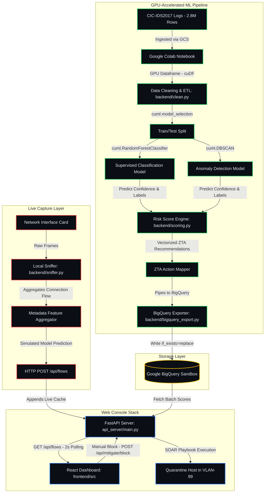

# 🛡️ NetworkGuard — High-Level Design & System Architecture

This document details the High-Level Design (HLD) and data flow topology of **NetworkGuard**, a GPU-accelerated network intrusion detection console with automated Zero-Trust containment (SOAR).

---

## 📊 System Architecture Diagram

The system is split into three main modules: the **Data Engineering & ML Pipeline (GPU-Accelerated)**, the **Local Real-Time Capture Layer**, and the **Interactive Analyst Console (React + FastAPI)**.

---

## 🔄 Core Data Flows

### 1. The Real-Time Capture Loop (Live Traffic)
1. **Packet Capture:** `sniffer.py` binds to the active network interface card using Scapy.
2. **Flow Aggregation:** Packets are grouped by connection keys `(Source IP, Destination IP)`. Feature metrics like packet rates, bytes, and TCP flag counts are computed on the fly.
3. **API Dispatch:** Flows are packaged into JSON structures matching the `FlowRequest` schema and POSTed to `/api/flows` on the local FastAPI server.
4. **UI Update:** The React console polls `/api/flows` every 2 seconds, displaying live captured network data on the **Live Feed** and **Attack Breakdown** views.

### 2. The Training and Evaluation Pipeline (GPU Notebook)
1. **GPU Data Extraction (ETL):** `clean.py` loads raw CSV files from Google Cloud Storage into `cuDF` dataframes, strip-normalizing columns and dropping duplicate entries.
2. **Model Training:** `model.py` loads `cuml.ensemble.RandomForestClassifier` and `cuml.cluster.DBSCAN` to train classification and anomaly detection models directly on the NVIDIA T4 GPU VRAM.
3. **Risk Scoring & Mapping:** Class predictions, probabilities (confidence), and anomaly tags are computed. `scoring.py` evaluates a unified 0-100 risk score and maps it to Zero-Trust actions.
4. **BigQuery Export:** `bigquery_export.py` converts cuDF structures back to host-side Pandas and uploads the dataframes into Google BigQuery tables.

### 3. Automated & Manual Containment (SOAR)
1. **Automatic Policy:** The FastAPI backend continuously watches incoming sniffer logs. If a threat's risk score exceeds `65.0` (High/Critical), a policy engine automatically logs containment commands.
2. **Manual Containment:** Security analysts can click **"Enforce Revocation"** on any threat card.
3. **Mitigation Execution:** A POST request to `/api/mitigate/block` triggers the backend SOAR playbook:
   - Revokes active OIDC session tokens for the compromised handle.
   - Restricts local router firewall access.
   - Segregates the client IP into quarantine segment `VLAN-99`.

---

## ⚡ Technology Stack

### Acceleration Layer
* **NVIDIA cuDF:** GPU-accelerated dataframes utilized to run data parsing and cleaning ~34x faster than standard CPU Pandas.
* **NVIDIA cuML:** Runs GPU-accelerated Machine Learning algorithms (RandomForest and DBSCAN Clustering) to classify attacks on massive datasets.

### Backend Layer
* **FastAPI:** High-performance async Python API framework handles authentication, flow buffering, and SOAR endpoints.
* **Scapy:** Real-time network sniffer engine capturing live packet meta-headers from the network interface card.

### Frontend Layer
* **React + TypeScript (Vite):** Powering the analyst console.
* **Framer Motion:** Smooth slide-in drawer details panels and authentication handshake micro-animations.
* **Recharts:** High-density visualizations (pie charts, AreaCharts, line/bar charts) for traffic distribution, benchmarks, and trends.
